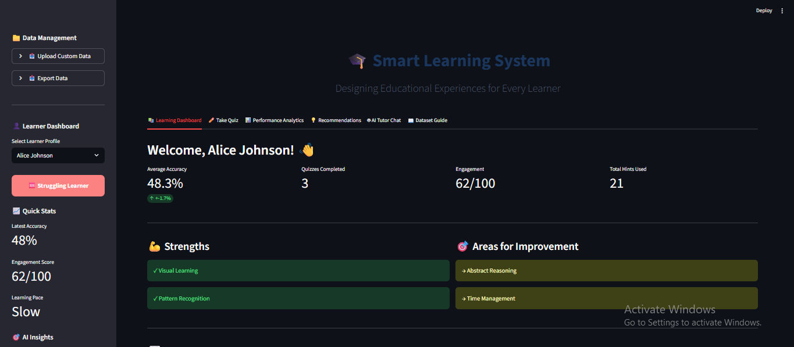

<div align="center">

# AI-Powered Personalized Learning System 
### Designing Smart Educational Experiences for Every Learner 



<p><b> A smart AI-driven learning platform that adapts quizzes, learning paths, and feedback based on each learner’s performance & engagement.</b></p>

---


</div>

---

##  Key Features 🌈

✅ **Learner Profiling** (Struggling / Average / Advanced)  
📊 **Engagement Tracking** (0–100 score)  
🎯 **Adaptive Quiz Difficulty** (Easy → Medium → Hard)  
🧭 **Personalized Learning Path Generator**  
📌 **Interactive Dashboard** (Progress + Insights)  
🧠 **Smart Recommendations** (Strengths & Weaknesses based)  

---

##  AI/ML Techniques Used 🤖

- 📌 **KMeans Clustering** → Learner Segmentation  
- 🌳 **Decision Tree Classifier** → Learner Classification  
- 🎯 **Rule-Based Recommendation Engine** → Learning Path + Quiz Adaptation  

---

## Tech Stack 🖥️

| Category | Tools |
|---------|------|
| 🎨 Frontend | Streamlit |
| 📂 Data | Pandas, NumPy |
| 🧠 ML Models | Scikit-learn |
| 📊 Visualization | Plotly |
| 🚀 Deployment | Streamlit Cloud / Local |

---

## Project Links 🔗

📁 **Drive Folder ( All Files ) :** [Open Folder](https://drive.google.com/drive/folders/1atVCuWNVSUrkbQAzet8V5jTWNY0L__nG?usp=sharing)  
🎥 **Demo Video ( Direct File Link ) :** [Watch Here](https://drive.google.com/file/d/1r0Ee4hYc0YcWognMBI8sG8PDzLwRrC2o/view?usp=sharing)  
📄 **Project Report ( Google Docs ) :** [Open Here](https://docs.google.com/document/d/1utdZKtfxae8w6aFAgvyIY_kRzNuh-BQ0nP65TjIJwcQ/edit?usp=sharing)  
📊 **Presentation ( Google Slides ) :** [View Here](https://docs.google.com/presentation/d/10IJQf8mhEpU8XmHI8S8soGmwcySmDyfTcfdPpS_HSMg/edit?usp=sharing)  
📋 **Colab Link :** [View Here](https://colab.research.google.com/drive/1K8EQn1D-HLlKnOO7faC3hVDrp87CuLur?usp=sharing)


---


## Project Structure 📁

```bash
AI-Personalized-Learning-System/
│── Smart_Learning_System.py
│── requirements.txt
│── README.md
├── notebooks/
│   └── AI_Personalized_Learning_System.ipynb
├── data/
│   ├── student_performance_dataset_500.csv
│   └── student_quiz_performance_500.csv
    └── quiz_question_bank_500.csv
└── assets/
    ├── banner.png
    └── screenshots/
